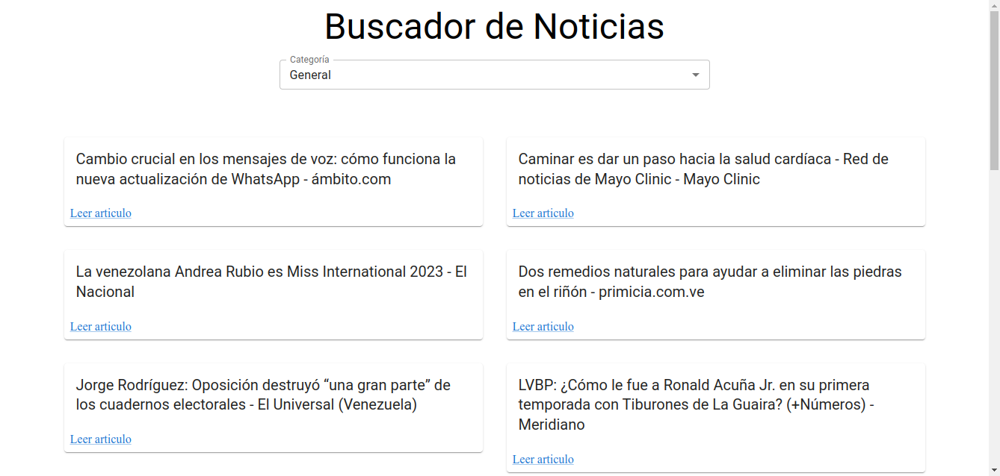

## Purpose

Show current news via an api using the Mui component library

## Begin

### Project installation

```bash
npm i

# or

pnpm i

# or

bun i
```

### API used

[News Api](https://newsapi.org/)

### Environment variable

```env
VITE_API_KEY = "xxxx"
```

### Run project

```bash
npm run dev

# or

pnpm run dev

# or

bun run dev
```
